# Fintech-NLP

Welcome to an Natural Language Processing of Bitcoin and Ethereum articles on the internet using , coded in Python, jupyternotebook.

Below you will find an overview of the analysis and henceforth the summary.

Here is the jupyter notebook kerenl for a deep dive into the code:

  

## Overview

### 1. Creating Dataframes

First we read in the csv files and turn them into dataframes to analyse the data.

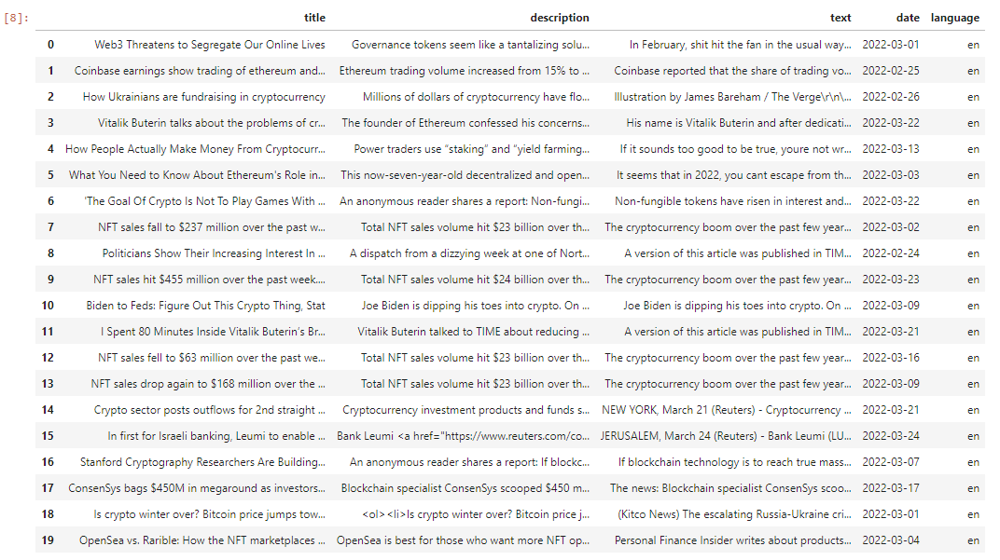

### 2. Sentiment Analysis

Secondly, we analyse the sentiment of the articles. This reveals the occurence of positive or negative emotion charged in words. This helps us identify the general theme of an article.

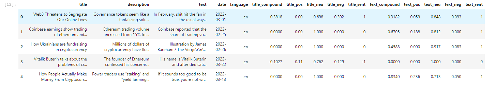 
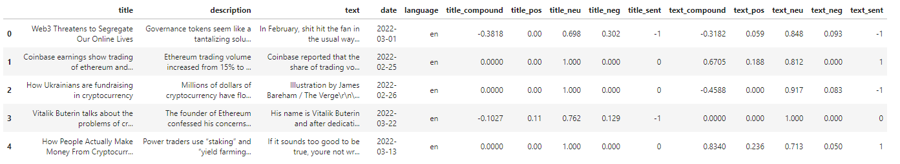

### 3. Tokenizing Text and NGRAM

Turn the text into tokens to later use it to create a word cloud.

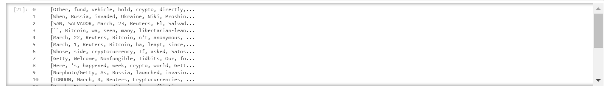
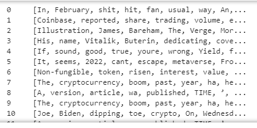  

NGRAM Calculation on the token text.

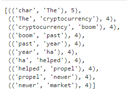
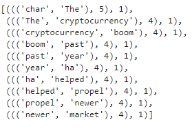

### 4. Wordcloud it up

Generate a wordcloud using the token text data.

#### Bitcoin Wordcloud
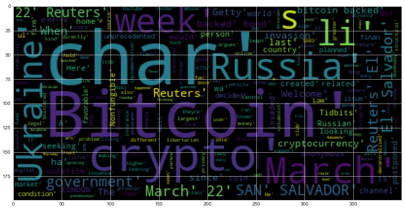  

#### Etherem Wordcloud
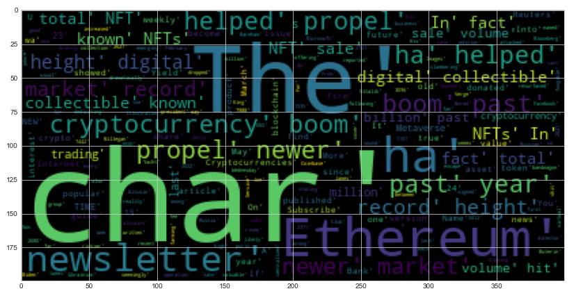

### 5. Nnamed-entity Recognition (NER) Analysis

Finally, use the token data to perform a NER analysis.

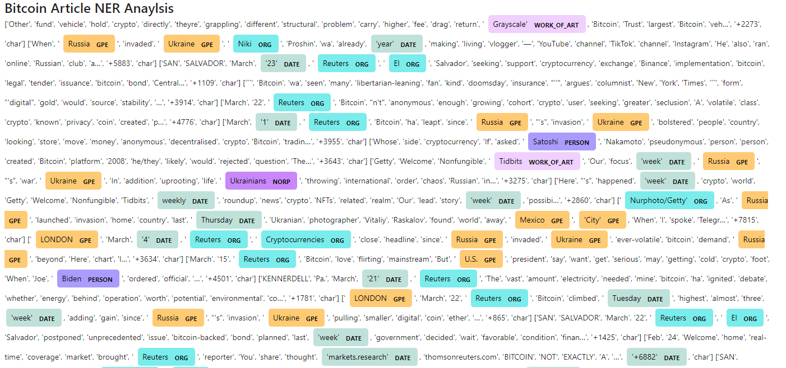  

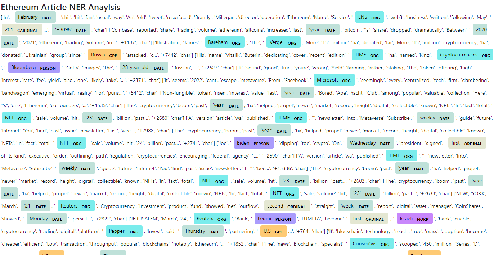

## Summary

In conclusion, we can see geopgraphical words come up in the anaylsis such as Russia and Ukraine. With some outside research we can identify the reason behind this, and mainly it is due to the conflict occuring in those countries. This has caused more news reports and articles highlighing this particular geographical regions.

Furthermore, we see primary words such as NFT in the ethereum analysis, which is a main product of the ethereum blockchain.

